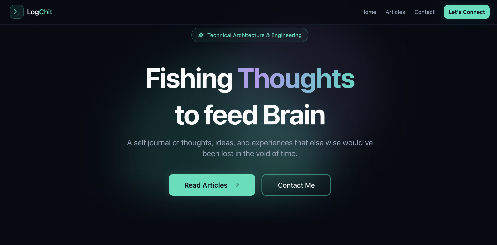
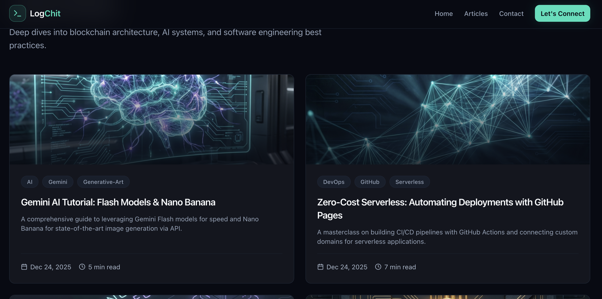

# 🚀 LogChit.com: Zero-Friction Thought Architecture

Welcome to **LogChit.com**, a high-performance, cyber-minimalist technical blog built for the modern era. This project is a living demonstration of how AI-native development workflows can collapse the time between "thought" and "deployment."

## 🧠 The AI-Native Core
This application was engineered using **Antigravity IDE** (by Google) powered by the **Gemini 3 Flash** model. It isn't just a blog; it's an automated publishing engine where the IDE acts as a digital architect.

### How it Works:
1.  **Thought Capture**: I explain a complex technical topic or a fleeting idea in the **Antigravity Chat Interface**.
2.  **Autonomous Content Engineering**: Antigravity understands the context and autonomously:
    *   Generates SEO-optimized Markdown content inside `src/lib/posts_markdown/`.
    *   Creates premium, ultra-high-definition thumbnails using **Gemini** (following a strict "Cyber-Minimalist" design language).
    *   Updates the post registry at `src/lib/posts_markdown/index.ts` to manage metadata and state.
3.  **Instant Ship**: A simple "push" command triggers the CI/CD pipeline. Within **20-30 seconds**, the article is live and served globally.

---

## 🛠️ Tech Stack
*   **Framework**: [Next.js 14+](https://nextjs.org/) (App Router, TypeScript)
*   **Styling**: [Tailwind CSS](https://tailwindcss.com/) with a custom "Cyber-Minimalist" theme.
*   **Engine**: Antigravity IDE + Gemini 3 Flash.
*   **Deployment**: GitHub Pages (Static Export).
*   **Live Site**: [https://logchit.com](https://logchit.com)

---

## 🏗️ Architecture & Workflows

### 📂 Content Structure
All posts are modular and managed through the following architecture:
*   `src/lib/posts_markdown/`: Contains the raw `.md` files generated by the AI.
*   `public/thumbnails/`: Contains the AI-generated visually stunning banners.
*   `src/lib/posts_markdown/index.ts`: The **Source of Truth**. This file clubs metadata, tags, and thumbnails together, acting as the bridge between raw content and the UI.

### 🤖 Intelligent Instructions
The project utilizes `.agent/rules/instructions.md` to ensure the AI always adheres to the "Cyber-Minimalist" aesthetic (Deep Slate backgrounds, Electric Teal & Soft Violet accents, Glassmorphism). Every conversation with the IDE is governed by these rules to maintain a premium, high-tech brand identity.

---

## ⚡ Deployment Pipeline
The app uses a custom GitHub Action that:
1.  Builds the Next.js project into a static site.
2.  Handles the custom domain handshake for `logchit.com`.
3.  Serves the final assets over a lightning-fast CDN via GitHub Pages.

---

**Built with ⚡ by PK Karn via Antigravity IDE**
